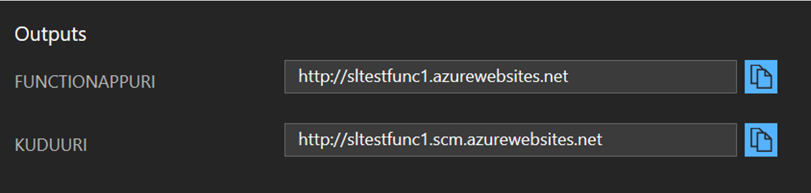
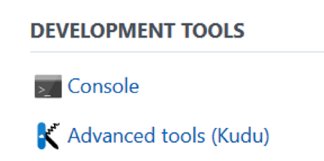
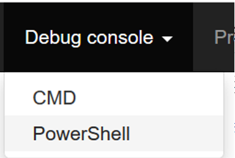
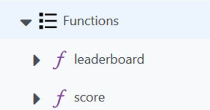

# Building blocks for gaming on Azure

master branch status

AppVeyor: 

<!--
Travis:   
-->

## About

Nether is a project composed of reusable set of building blocks, projects, services and best practices designed for Gaming workloads powered by Microsoft Azure, aimed to be beneficial for many type of game developers seeking inspiration or a fully implemented solution.

## Getting Started

Click on the scenario below that best fit your needs to get started:

### Leaderboards

* [Top N Leaderboard](src/cloud/functions/leaderboards/top-n/) (tags: #serverless, #functions, #cosmosdb)
* Around Me Leaderboard (tags: #serverless, #functions, #cosmosdb)

### Inventories

* Basic Cloud Inventory

### Match Making

* Simple N Player Match Making

### Game Server Hosting

* ...

### Analytics

* Daily / Monthly Active Users, DAU/MAU

### Deployment

The quickest way to get started and explore Nether is to use the quickstart deployment. This will deploy a Function App with no functions, but with the function templates that can be deployed thrugh 

Click the below button to start deployment.

(Ctrl + Click will open the portal with the deployment in a separate tab in most browsers, hence allow you to keep this documentation available and ready to use)

#### Creating a function

Once the template deployment has completed then you can deploy one or more of the built-in scenarios.

To do this, you need to go to the Kudu site behind your Functions App.

##### Finding Kudu
In the outputs for the template deployment there is a `KuduUri` value that will be something like `yourapp.scm.azurewebsites.net`, and you can browse to that.

Alternatively, you can navigate to the Function App in the Azure Portal, click on "Platform Features" and then choose "Advanced Tools (Kudu)" as shown below:

##### Deploying a template

In Kudu, select "PowerShell" from the "Debug console" menu:

In the PowerShell console, navigate to `site\wwwroot` (either by clicking the hyperlinked directories, or by typing `cd site\wwwroot`)

At this point you should see `deploy.ps1` listed. This is the script that allows you to easily deploy scenarios.

To deploy a scenario, run `./deploy.ps1 -Group <groupname> -Scenario <scenario>`

E.g `./deploy.ps1 -Group leaderboards -Scenario top-n`

Current supported combinations for Group and Scenario are:

|Group|Scenario|Description|
|-|-|-|
|leaderboards|top-n|functions to capture scores and show a top-n (e.g. top 10) leaderboard|

After running the `deploy.ps1` script you should see new folders that have been created:

And navigating back to the Azure Functions blade in the [Azure Portal](https://portal.azure.com) you will see the newly created functions:

## Reporting issues and feedback

If you encounter any bugs please file an issue in the Issues section of our GitHub repo.

## Contribute Code

We welcome contributions. To contribute please follow the instructions on
[How to contribute?](CONTRIBUTING.md)

This project has adopted the [Microsoft Open Source Code of Conduct](https://opensource.microsoft.com/codeofconduct/).
For more information see the [Code of Conduct FAQ](https://opensource.microsoft.com/codeofconduct/faq/)
or contact [opencode@microsoft.com](mailto:opencode@microsoft.com) with any additional questions or comments.

## License

Nether is licensed under the MIT License.
