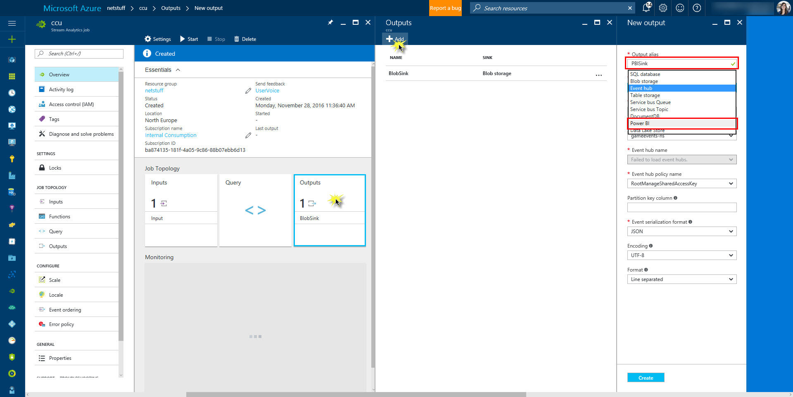
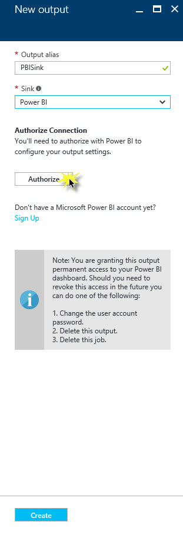
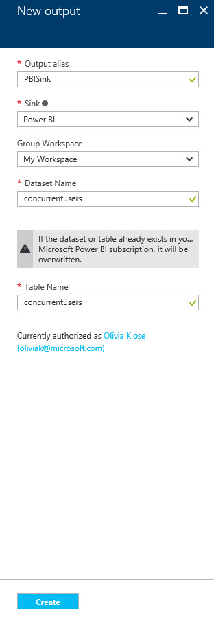
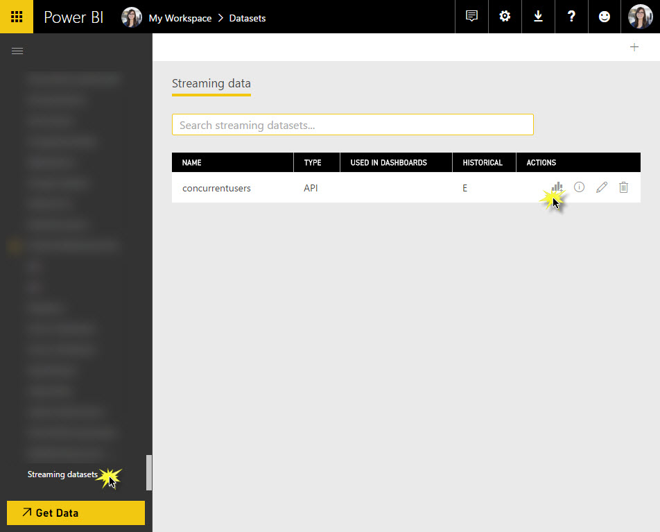

# Analytics

The analytics building block of Nether builds an architecture specified in [here](analytics-architecture.txt).

## Prerequisites

### Power BI

## What does it do?
Currently, the following key KPIs will be delivered by the analytics building block:
* DAU (daily active users): number of distinct users per day
* MAU (monthly active users): number of distinct users per monthly
* non-distinct daily active users, i.e. number of active sessions per day

The analytics part of Nether deploys an architecture using an ARM template and consists of the following high-level parts:
1. Event ingest, including the event data generator
2. Batch layer or cold path
3. Real time layer or hot path

### Event Ingest

Game events are being sent from the client to a then deployed event hub. Information on what the structure of a game event is, refer to the [event APIs of analytics]](api/analytics/ReadMe.md).
There is a simulator game event generator that sends such specified game events to be found [here](https://github.com/dx-ted-emea/nether-playground/tree/master/GameEventsGenerator).
The event hub has the following consumer groups:
* asaRaw: For stream analytics job on raw data.
* asaCCU: For stream analytics job on concurrent users.

### Real-time Layer / Hot Path

As seen in the [architecture diagram](analytics-architecture.txt), there are two Azure stream analytics (ASA) jobs that run queries on the event ingest:
1. Concurrent Users: This ASA job runs a query to calculate the number of concurrent users in specified time window. 
2. Raw Events: This ASA job stores all incoming game events in an Azure blob storage partitioned by date={YY-mm-dddd}. The raw events will be further aggregated and analysed in the batch layer. The T-SQL script can be found [here](..\deployment\analytics-assets\ASA\rawdata.txt).

#### Concurrent Users
Source: Event hub deployed by the ARM template, using the consumer group "asaCCU".
Query: The T-SQL Query can be found [here](..\deployment\analytics-assets\ASA\ccu.txt).
Sink: Power BI. This has to be set up manually, since as of now setting up Power BI as a sink cannot be set within an ARM template. Click on the stream analytics job ("ccu") in the Azure portal, then on *Outputs* and add another output as shown here:

Output alias: PBISink
Sink: Power BI
Authorize connection as shown here:

Configure the rest of the output:
Dataset name: concurrentusers
Table name: concurrentusers

Navigate to powerbi.com, the data ingest can be found under the streaming datasets. Create a report from it as shown below.

#### Raw Events
Source: Event hub deployed by the ARM template, using the consumer group "asaRaw".
Query: The T-SQL Query can be found [here](..\deployment\analytics-assets\ASA\rawdata.txt).
Sink: Azure blob storage that is provisioned by the ARM template, in the container *rawdata* under folderpath rawdata/date={yyyy-mm-dd}. Partitioned by date as opposed to by hour due to hive performance reasons.

#### Start Stream Analytics Jobs
Start both stream analytics jobs from the Azure portal. Cannot be triggered from within ARM template as of now.

### Batch Layer / Cold Path

[To Do]

## How do I deploy it?

[To Do]

## Configuration required for Azure Data Factory Pipeline

Upload the Hive script dau.hql (under deployment/analytics-assets) onto another blob storage account. Configure the following parameters in analyticsdeploy.parameters.json accordingly:
* hiveScriptFilePath, e.g. [container]/[file-path]
* hiveScriptStorageAccountName
* hiveScriptStorageAccountKey