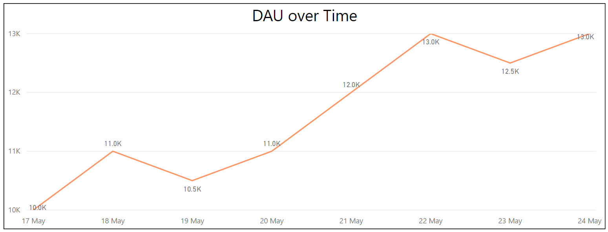

# Daily Active Users, DAU

__Daily Active Users (DAUs)__ is the number of unique users that start at least one session in your app on any given day. DAU is a high level metric about the usage of your game over time. 

## End Result

 A DAU count is a snapshot of time, for example on 17/05/2017 a game has 10,000 DAU. [date, count]

| Date         | Count          |
| -------------|:--------------:|
| 17/05/2017   | 10,000         |
 
 It is important to report DAU over time to see the progression of your game, for example the table below

| Date         | Count          |
| -------------|:--------------:|
| 17/05/2017   | 10,000         |
| 18/05/2017   | 11,000         |
| 19/05/2017   | 10,500         |
| 20/05/2017   | 11,000         |
| 21/05/2017   | 12,000         |
| 22/05/2017   | 13,000         |



## Pre-Requisites

The DAU recipe depends on the NetherAnalytics.sln file and assumes that you have the Azure services already. These analytical queries rely on an Azure Data Lake Analytics instance as well as a connected Azure Data Lake Store.

Assumptions made for instructions below:
* messages are sent from the client to Azure Event Hubs
* messages are formatted using the standard Nether JSON Format
* messages are sent to a Azure Data Lake Analytics Store

## Recipe Steps

Follow the below steps to implement this __Daily Active Users (DAU)__ recipe. 


### 1 Telemetry Needed from the Game

Using the Nether REST API or the provided Client SDKs setup the game to send the following messages at these times.

| Message to send                    | At what time                              |
|------------------------------------|-------------------------------------------|
| [session-start](https://github.com/MicrosoftDX/nether/blob/master/src/Nether.Analytics.MessageFormats/SessionStart.cs)      | Send a ```session-start``` message every time a player starts a session in your game |


### 2 Configuration of Message Processor

The telemetry mentioned above for the DAU query is a simple set and just directs the incoming messages to an Azure Data Lake Store for further analysis later by the DAU.usql job described below

An implementation of a [session-start](https://github.com/MicrosoftDX/nether/blob/master/src/Nether.Analytics.Host/ProgramEx.cs) message can be found in source code for Nether.Analytics.Host and can be useful to have as a reference while following the below steps.

#### 2.1 Setup Listener


```cs
// Setup Listener
var listenerConfig = new EventHubsListenerConfiguration
{
    EventHubConnectionString = "YOUR_EVENT_HUB_CONNECTION_STRING_GOES_HERE",
    EventHubPath = "YOUR_EVENTHUB_NAME_GOES_HERE",
    ConsumerGroupName = "YOUR_CONSUMER_GROUP_GOES_HERE",
    StorageConnectionString = "YOUR_STORAGE_ACCOUNT_CONNECTION_STRING_GOES_HERE",
    LeaseContainerName = "NAME_OF_LEASE_CONTAINER_GOES_HERE"
};

var listener = new EventHubsListener(listenerConfig);
```

### 2.2 Setup Message Parser

(TODO: Make sure the below code is accurate and up to date)
```cs
// Setup Message Parser
var parser = new EventHubListenerMessageJsonParser(new ConsoleCorruptMessageHandler());
```

### 2.3 Setup Output Managers
```cs
// Setup Output Managers
var outputManager = new DataLakeStoreOutputManager(domain, webApp_clientId, clientSecret, subscriptionId, adlsAccountName);
```

### 2.4 Setup Message Router
```cs
// Build up the Router Pipeline
var builder = new MessageRouterBuilder();
var filePathAlgorithm = new PipelineDateFilePathAlgorithm(newFileOption: NewFileNameOptions.Every5Minutes);

// Setting up "Daily Active Users Recipe"
var dauSerializer = new CsvOutputFormatter("id", "type", "version", "gameSession", "enqueueTimeUtc", "gamerTag");

builder.Pipeline("dau")
    .HandlesMessageType("session-start", "1.0.0")
    .OutputTo(new ConsoleOutputManager(dauSerializer)
        , new FileOutputManager(dauSerializer, filePathAlgorithm, @"C:\dev\USQLDataRoot")
        , new DataLakeStoreOutputManager(
            dauSerializer,
            filePathAlgorithm,
            serviceClientCretentials,
            _configuration[NAH_Azure_SubscriptionId],
            _configuration[NAH_Azure_DLSOutputManager_AccountName])
        );
        builder.DefaultPipeline
            .AddHandler(new RandomIntMessageHandler())
            .OutputTo(new ConsoleOutputManager(new CsvOutputFormatter()));

var router = builder.Build();
```

### 2.5 Setup Message Processor
```cs
var messageProcessor = new MessageProcessor<EventHubJsonMessage>(listener, parser, router);


// Run in an async context since main method is not allowed to be marked as async
Task.Run(async () =>
{
    await messageProcessor.ProcessAndBlockAsync();
}).GetAwaiter().GetResult();
```

### 3 Setup Job Queries
The purpose of the DAU.usql query is to calculate the daily active users of your game over time. A daily active user is a distinct count of any user, using your game within a single UTC time, day period (no matter how many times a single user visits the game that day). The single query DAU.usql described and linked below could be run:
* Once a __day__ to compute a new DAU value (1 Date, 1 Count)
* Or on a __weekly__ basis (7 Dates, 7 counts)
* Or on a __monthly__ basis (28-31 Dates, 28-31 Counts)


| Query that should be run           | By what service                           |
|------------------------------------|-------------------------------------------|
| [DAU.usql](../../../src/Nether.Analytics.DataLake.Jobs/DAU.usql) | Azure Data Lake Analytics |

#### 3.1 Setup and Schedule Query1

(TODO: Explain how someone should go ahead to setup the required query to be run at appropriate times)

### 4 Result Details

(TODO: Briefly explain what result you should expect, when it should be there and where to look for it)

#### 4.1 Consume the result

(TODO: Explain in detail what results that should be expected and how to consume the result. Explain file formats produced by using tables.)
