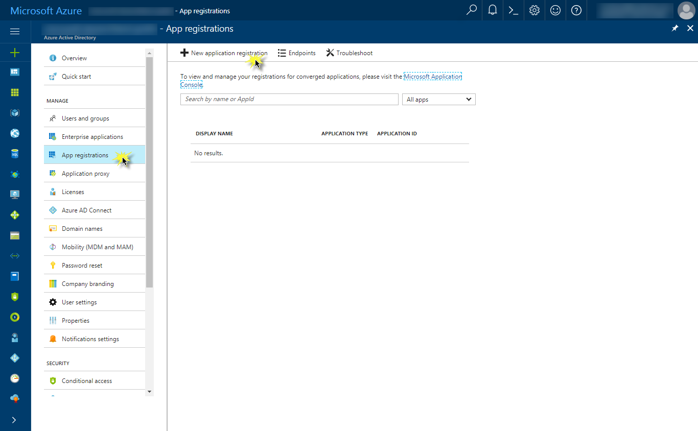
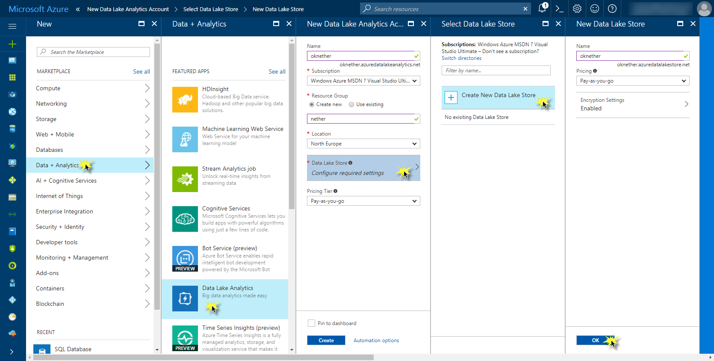
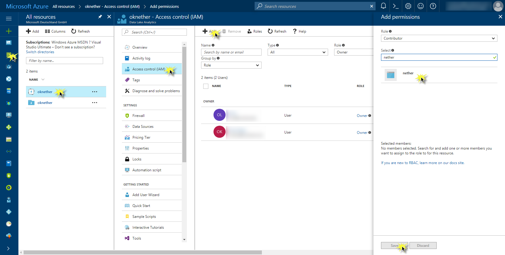
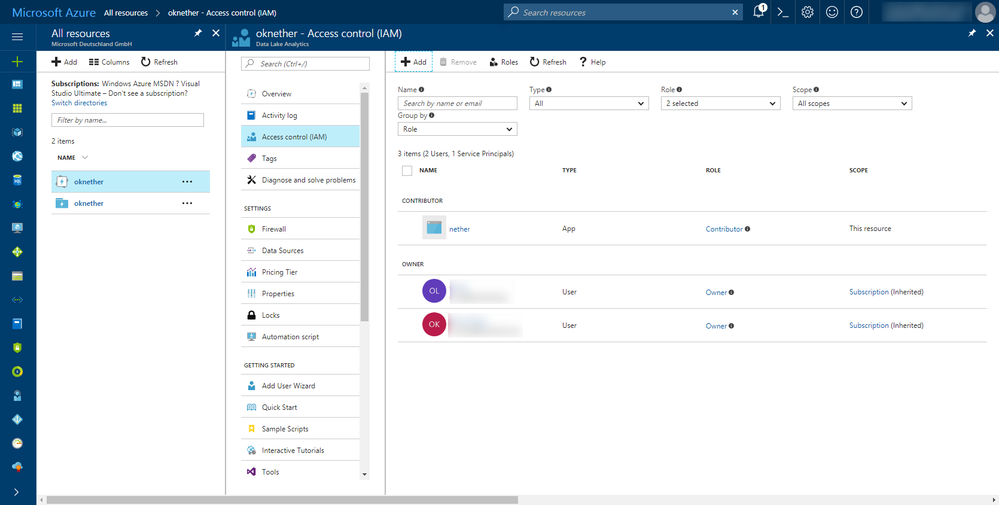
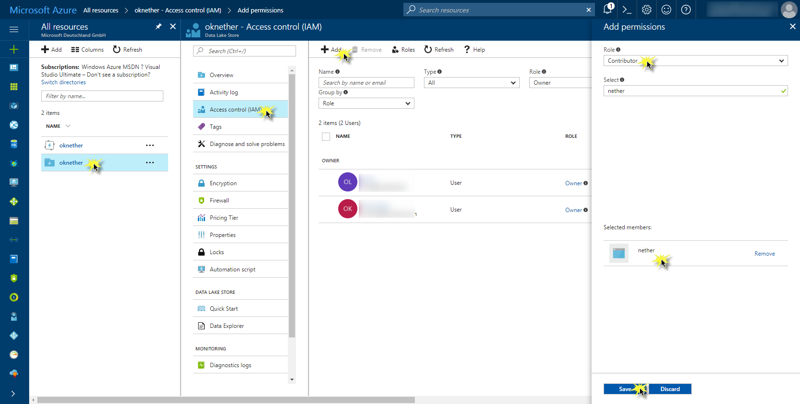

# Get started with setting up and running the Nether sample

[TO DO]

## Development Machine Setup

The goal of Nether is to be available on both Windows and OSX (Mac), hence any up to date version of those operating systems should be ok. It is more about selecting your preferred IDE for your selected operating system.

### IDE: Visual Studio or Visual Studio Code

Since this project strives for cross platform compatibility, we support both [Visual Studio Code](https://code.visualstudio.com) and [Visual Studio 2017](https://www.visualstudio.com/vs/). When using Visual Studio 2017, any edition (including the free community edition) will suffice.

These can be installed on your own computer, or you can use any of the provided Microsoft Azure VM Images [here](https://azuremarketplace.microsoft.com/en-us/marketplace/apps/category/compute?page=1&search=visual%20studio) that already contains Visual Studio 2017 and the Azure SDK 2.9.1 or later.


### Prerequisites

**Azure Powershell**

Nether has been designed to take advantage of various services that are part of the Microsoft Azure platform. This includes but is not limited to hosting the REST APIs that are Nether. As such, our default "production" deployment scripts are based on Azure and currently require use of the PowerShell cmdlets for Azure.

Azure Powershell is available via the [Web Platform Installer](https://www.microsoft.com/web/downloads/platform.aspx) or by issuing the command "install-module AzureRM" from the PowerShell command line. For more about the Azure Powershell Cmdlets, please see the [official documentation](https://docs.microsoft.com/en-us/powershell/).


## Set up Azure Services

### Azure Active Directory

Navigate to the [Azure portal](http://portal.azure.com) and to the **Active Directory**. Click on **App registrations** to create a **New application registration**:



Choose a name for the new application, set the type to **Web app / API** and specify any sign-on URL (you can also take the URL of Nether's GitHub repository):


Whilst creating an account with Azure Data Lake Analytics (in short: ADLA), one can create a new Azure Data Lake Store (in short: ADLS) account with which the ADLA account will be associated.


### Azure Data Lake Analytics and Store account

Create an **Azure Data Lake Analytics** account by navigating as pictured in the graph:



Add the app that you have registered in the previous step as a contributor to your ADLA  account as follows:



The registered app is now a contributor to your ADLA account:



Repeat the previous steps for your ADLS account:




### Set the correct environment variables
Setup-NetherAnalytics.ps1
Before launching the Nether Ingest solution, set the correct environment variables using the PowerShell script [Setup-NetherAnalytics.ps1](../../scripts/Setup-NetherAnalytics.ps1):


```powershell
$env:NAH_EHLISTENER_CONNECTIONSTRING = "Endpoint=sb://nether.servicebus.windows.net/;SharedAccessKeyName=RootManageSharedAccessKey;SharedAccessKey=h16jv6nc0...u2YH+U2xg0YI14="
$env:NAH_EHLISTENER_EVENTHUBPATH = "analytics"
$env:NAH_EHLISTENER_CONSUMERGROUP = "nether"
$env:NAH_EHLISTENER_STORAGECONNECTIONSTRING = "DefaultEndpointsProtocol=https;AccountName=netherdashboard;AccountKey=oT30a8/BSwTFg/4GGWLPCeGIHBfgDcMf...yJMoX2lvTnWSIrjtwU9kg9YaL0Qw==;EndpointSuffix=core.windows.net"
$env:NAH_EHLISTENER_LEASECONTAINERNAME = "sync"
$env:NAH_AAD_DOMAIN = "microsoft.onmicrosoft.com"
$env:NAH_AAD_CLIENTID = "b43e3e6c-77...-a3683b27e546"
$env:NAH_AAD_CLIENTSECRET = "QxoNhF1csZV...3yil9Etnp4bw="
$env:NAH_AZURE_SUBSCRIPTIONID = "3a856395-1...5d-527c857e5995"
$env:NAH_AZURE_DLSOUTPUTMANAGER_ACCOUNTNAME = "nether"
$env:NAH_AZURE_DLA_ACCOUNTNAME = "nether"
$env:NAH_FileOutputManager_LocalDataFolder = "c:\tmp\USQLDataRoot"
```


### Run the console application

Nether.Test.ConsoleClient