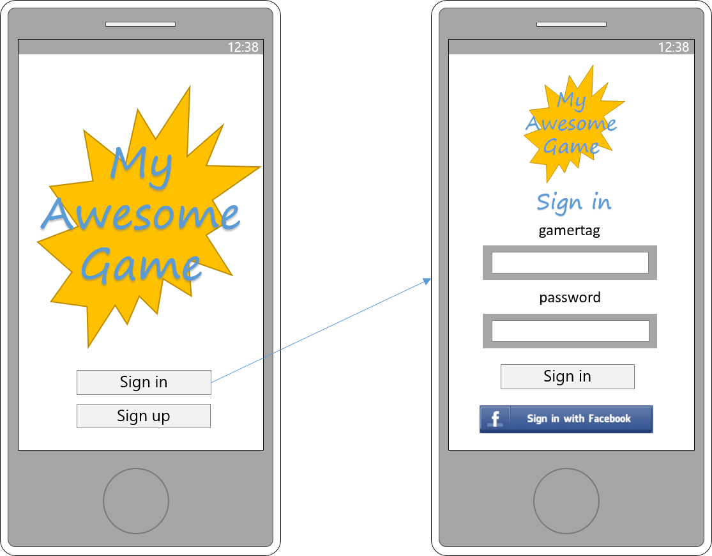
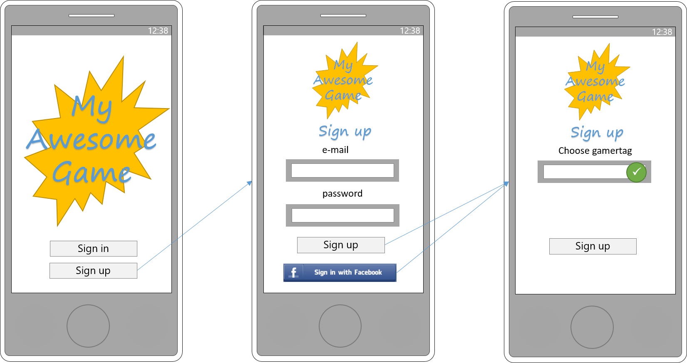

# Identity in Nether #

Any game developer should be able to add Identity support easily into their game.

## Configuring Nether Identity
WARNING: The identity implementation in still under development, so expect these details to change :-)

### Configuring facebook authentication

Information on configuring facebook sign in is in the [configuration docs](../configuration/identity.md)

### Configuring users
The Users and Logins APIs allow you to programmatically add users. Additionally, the facebook custom flow creates users in the player role based on a facebook user acces token.

The users for testing with the in-memory  are currently created in `Nether.Web/Features/Identity/Configuration/Users.cs` as a temporary workaround.

When Nether initially starts up it performs a check to see whether there are any users in the user store. If not then it will pre-create a user with username `netheradmin` and password specified in the config under `Identity:InitialSetup:AdminPassword`. It is strongly recommended that you change this password when you deploy.

## Authenticating with Nether Identity
The Nether Identity endpoint currently supports two means of authenticating: facebook user token and resource owner password (i.e. user name and password).
The facebook user token authentication uses a custom grant flow (`fb-usertoken`) to allow a non-interactive flow that receives a facebook user token (e.g. as per the facebook Unity extension) and converting it to a Nether token.
The resource owner password flow allows a user to sign in with user name and password combination. The main drivers for this flow are integration and load testing.

### Interactive (implicit) flow
The interactive/implicit flow is used when signing in via the browser. The user 

Adding new providers for this flow is relatively straight-forward. This flow currently supports the following providers
* Username + Password
* Facebook

### Resource owner (username + password) flow 
The resource owner (username + password) flow allows programmatic authentication with a username and password

### Facebook user access token flow
The facebook user access token flow allows programmatic authentication with a facebook user access token. This is useful for scenarios where the game has a facebook SDK (e.g. Unity or JavaScript) that allows them to perform authentication with facebook and then use the resulting access token from facebook to authentication with nether. This provides tight control over the sign-in experience.

Using this flow, if the facebook user hasn't been encountered before then a new user will be created and associated with the facebook identity.

This is implemented using an [OAuth 2 extension grant](https://tools.ietf.org/html/rfc6749#section-4.5). 

### Guest flow
The guest flow allows for a lightweight authentication where the client simply sends a single identifier (e.g. device id for mobile games). This authentication mechanism is relatively weak and should be disabled in [configuration](../configuration/identity.md) if not needed.

Using this flow, if the facebook user hasn't been encountered before then a new user will be created and associated with the guest identifier.

This is implemented using an [OAuth 2 extension grant](https://tools.ietf.org/html/rfc6749#section-4.5).

## IdentityTestClient

This test client allows you to test different authentication flows supported by Nether, as well as providing sample implementations for those flows.

The client takes command line switches to allow you to specify which flow to use and the paramaters required for the flow. Running the client without any options shows the in-built help.

Flows covered by the client:
* client-credentials - this is a simple flow that validates the client id and secret. Implemented using IdentityModel.Client
* resource-owner - performs the resource owner flow. Implemented using IdentityModel.Client
* fb-usertoken - performs the fb-usertoken flow, using the extension grant. Implemented using IdentityModel.Client
* fb-usertoken-raw - performs the fb-usertoken flow, using the extension grant. Implemented using raw HttpClient calls
* guest - performs the guest-access flow, using the extension grant. Implemented using IdentityModel.Client
* guest-raw - performs the guest-access flow, using the extension grant. Implemented using raw HttpClient calls

## Game Sign in ##

## Game Sign up ##

