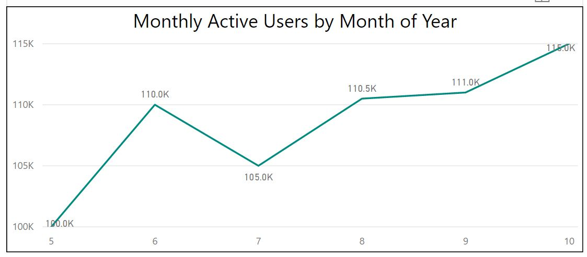

# Monthly Active Users, MAU

__Monthly Active Users (MAUs)__ is the number of unique users that start at least one session in your app within a calendar month. MAU is a high level metric about the usage of your game over time.

_It is highly recommended to implement DAU and MAU as a pair, check out the DAU recipe [here](../daily-active-users.md)_ 

## End Result

 A MAU count is a snapshot of time, for example in May(05) a game has 100,000 MAU. [month, count]

| Date         | Count          |
| -------------|:--------------:|
| 05   | 100,000         |
 
 It is important to report DAU over time to see the progression of your game, for example the table below

| Date         | Count          |
| -------------|:--------------:|
| 05   | 100,000         |
| 06   | 110,000         |
| 07   | 105,500         |
| 08   | 110,500         |
| 09   | 111,000         |
| 10   | 115,000         |



## Pre-Requisites

The MAU recipe depends on the NetherAnalytics.sln file and assumes that you have the Azure services already. These analytical queries rely on an Azure Data Lake Analytics instance as well as a connected Azure Data Lake Store.

Assumptions made for instructions below:
* messages are sent from the client to Azure Event Hubs
* messages are formatted using the standard Nether JSON Format
* messages are sent to a Azure Data Lake Analytics Store

## Recipe Steps

Follow the below steps to implement this __Monthly Active Users (MAU)__ recipe. 


### 1 Telemetry Needed from the Game

Using the Nether REST API or the provided Client SDKs setup the game to send the following messages at these times.

| Message to send                    | At what time                              |
|------------------------------------|-------------------------------------------|
| [session-start](../../src/Nether.Analytics.MessageFormats/SessionStart.cs)      | Send a ```session-start``` message every time a player starts a session in your game |


### 2 Configuration of Message Processor

The telemetry mentioned above for the MAU query is a simple set and just directs the incoming messages to an Azure Data Lake Store for further analysis later by the MAU.usql job described below

An implementation of a [session-start](../../src/Nether.Analytics.Host/ProgramEx.cs) message can be found in source code for Nether.Analytics.Host and can be useful to have as a reference while following the below steps.

#### 2.1 Setup Listener


```cs
// Setup Listener
var listenerConfig = new EventHubsListenerConfiguration
{
    EventHubConnectionString = "YOUR_EVENT_HUB_CONNECTION_STRING_GOES_HERE",
    EventHubPath = "YOUR_EVENTHUB_NAME_GOES_HERE",
    ConsumerGroupName = "YOUR_CONSUMER_GROUP_GOES_HERE",
    StorageConnectionString = "YOUR_STORAGE_ACCOUNT_CONNECTION_STRING_GOES_HERE",
    LeaseContainerName = "NAME_OF_LEASE_CONTAINER_GOES_HERE"
};

var listener = new EventHubsListener(listenerConfig);
```

### 2.2 Setup Message Parser

```cs
// Setup Message Parser
var parser = new EventHubListenerMessageJsonParser(new ConsoleCorruptMessageHandler());
```

### 2.3 Setup Output Managers
```cs
// Setup Output Managers
var outputManager = new DataLakeStoreOutputManager(domain, webApp_clientId, clientSecret, subscriptionId, adlsAccountName);
```

### 2.4 Setup Message Router
```cs
// Build up the Router Pipeline
var builder = new MessageRouterBuilder();
var filePathAlgorithm = new PipelineDateFilePathAlgorithm(newFileOption: NewFileNameOptions.Every5Minutes);

// Setting up "Daily Active Users Recipe" (same dataset for Monthly Active Users)
var dauSerializer = new CsvOutputFormatter("id", "type", "version", "gameSession", "enqueueTimeUtc", "gamerTag");

builder.Pipeline("dau")
    .HandlesMessageType("session-start", "1.0.0")
    .OutputTo(new ConsoleOutputManager(dauSerializer)
        , new FileOutputManager(dauSerializer, filePathAlgorithm, @"C:\dev\USQLDataRoot")
        , new DataLakeStoreOutputManager(
            dauSerializer,
            filePathAlgorithm,
            serviceClientCretentials,
            _configuration[NAH_Azure_SubscriptionId],
            _configuration[NAH_Azure_DLSOutputManager_AccountName])
        );
        builder.DefaultPipeline
            .AddHandler(new RandomIntMessageHandler())
            .OutputTo(new ConsoleOutputManager(new CsvOutputFormatter()));

var router = builder.Build();
```

### 2.5 Setup Message Processor
```cs
var messageProcessor = new MessageProcessor<EventHubJsonMessage>(listener, parser, router);


// Run in an async context since main method is not allowed to be marked as async
Task.Run(async () =>
{
    await messageProcessor.ProcessAndBlockAsync();
}).GetAwaiter().GetResult();
```

### 3 Setup Job Queries
The purpose of the MAU.usql query is to calculate the monthly active users of your game over time. A monthly active user is a distinct count of any user, using your game within a calendar month period (no matter how many times a single user visits the game that month). The single query MAU.usql described and linked below could be run:
* Once a __month__ to compute a new MAU value (1 month, 1 Count)
* Every __6 monthS__ to compute a new MAU valueS (6 months, 6 Counts)
* Once a __year__ to compute a new MAU values (12 months, 12 Counts)


| Query that should be run           | By what service                           |
|------------------------------------|-------------------------------------------|
| [MAU.usql](../../../src/Nether.Analytics.DataLake.Jobs/MAU.usql) | Azure Data Lake Analytics |

#### 3.1 Setup and Schedule Query1

< currently under development to automate pipeline >


### 4 Result Details

__Extra information:__
A successful query _could_ be viewed in Visual Studio via the tools or the Azure Portal 

Go to the results folder in your Azure Data Lake Store
__PATH: adl://<datalakestorename>.azuredatalakestore.net/nether/mau/results/__

Open and view the output file (mauresults.csv) and find counts of unique users per month given the data input. (example below)


#### 4.1 Consume the result

As the output is a CSV file within a results folder, you could consume this file using many services including Power BI or other analytics tools.
